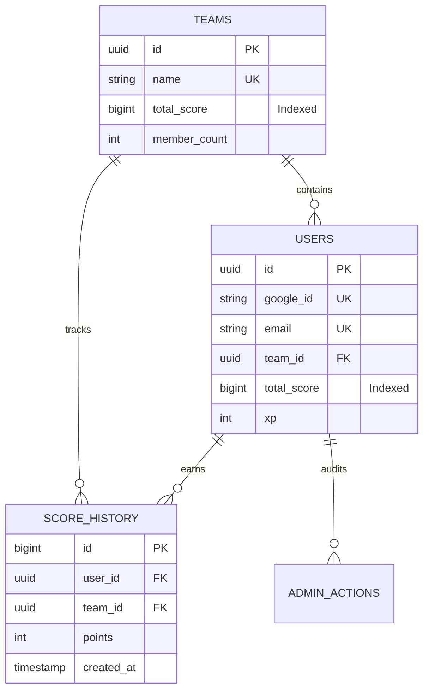

# Production-Ready Leaderboard & Global CRM Backend

This system is designed for massive scale (100K+ concurrent users), prioritizing data integrity through atomic transactions and read performance through aggregated columns and curated indexing.

## 1. MySQL 8.0 Schema (SQL)

```sql
-- -----------------------------------------------------
-- Table teams
-- -----------------------------------------------------
CREATE TABLE IF NOT EXISTS `teams` (
  `id` CHAR(36) NOT NULL,
  `name` VARCHAR(100) NOT NULL,
  `total_score` BIGINT UNSIGNED DEFAULT 0,
  `member_count` INT UNSIGNED DEFAULT 0,
  `created_at` TIMESTAMP DEFAULT CURRENT_TIMESTAMP,
  `updated_at` TIMESTAMP DEFAULT CURRENT_TIMESTAMP ON UPDATE CURRENT_TIMESTAMP,
  PRIMARY KEY (`id`),
  UNIQUE INDEX `name_UNIQUE` (`name` ASC),
  INDEX `idx_team_score` (`total_score` DESC)
) ENGINE = InnoDB;

-- -----------------------------------------------------
-- Table users
-- -----------------------------------------------------
CREATE TABLE IF NOT EXISTS `users` (
  `id` CHAR(36) NOT NULL,
  `google_id` VARCHAR(255) NOT NULL,
  `email` VARCHAR(255) NOT NULL,
  `name` VARCHAR(255) NOT NULL,
  `avatar_url` TEXT NULL,
  `role` ENUM('ADMIN', 'MANAGER', 'SALES', 'STUDENT') DEFAULT 'STUDENT',
  `team_id` CHAR(36) NULL,
  `total_score` BIGINT UNSIGNED DEFAULT 0,
  `xp` INT UNSIGNED DEFAULT 0,
  `level` INT UNSIGNED DEFAULT 1,
  `created_at` TIMESTAMP DEFAULT CURRENT_TIMESTAMP,
  `updated_at` TIMESTAMP DEFAULT CURRENT_TIMESTAMP ON UPDATE CURRENT_TIMESTAMP,
  PRIMARY KEY (`id`),
  UNIQUE INDEX `google_id_UNIQUE` (`google_id` ASC),
  UNIQUE INDEX `email_UNIQUE` (`email` ASC),
  INDEX `idx_user_score` (`total_score` DESC),
  INDEX `idx_team_lookup` (`team_id` ASC),
  CONSTRAINT `fk_user_team`
    FOREIGN KEY (`team_id`)
    REFERENCES `teams` (`id`)
    ON DELETE SET NULL
) ENGINE = InnoDB;

-- -----------------------------------------------------
-- Table score_history (Partitioning Recommended)
-- -----------------------------------------------------
CREATE TABLE IF NOT EXISTS `score_history` (
  `id` BIGINT UNSIGNED NOT NULL AUTO_INCREMENT,
  `user_id` CHAR(36) NOT NULL,
  `team_id` CHAR(36) NULL,
  `points` INT NOT NULL,
  `action_type` VARCHAR(50) NOT NULL, -- e.g., 'CHALLENGE_COMPLETE', 'ADMIN_ADJUST'
  `metadata` JSON NULL, -- Store contest_id, level_id, etc.
  `created_at` TIMESTAMP DEFAULT CURRENT_TIMESTAMP,
  PRIMARY KEY (`id`),
  INDEX `idx_history_user` (`user_id`, `created_at` DESC),
  INDEX `idx_history_team` (`team_id`, `created_at` DESC),
  CONSTRAINT `fk_history_user`
    FOREIGN KEY (`user_id`)
    REFERENCES `users` (`id`),
  CONSTRAINT `fk_history_team`
    FOREIGN KEY (`team_id`)
    REFERENCES `teams` (`id`)
) ENGINE = InnoDB;

-- -----------------------------------------------------
-- Table leaderboard_snapshots (For historical analysis)
-- -----------------------------------------------------
CREATE TABLE IF NOT EXISTS `leaderboard_snapshots` (
  `id` INT UNSIGNED NOT NULL AUTO_INCREMENT,
  `snapshot_type` ENUM('DAILY', 'WEEKLY', 'SEASONAL') NOT NULL,
  `entity_id` CHAR(36) NOT NULL, -- user_id or team_id
  `entity_type` ENUM('USER', 'TEAM') NOT NULL,
  `rank` INT UNSIGNED NOT NULL,
  `score` BIGINT UNSIGNED NOT NULL,
  `recorded_at` TIMESTAMP DEFAULT CURRENT_TIMESTAMP,
  PRIMARY KEY (`id`),
  INDEX `idx_snapshot_date` (`snapshot_type`, `recorded_at` DESC)
) ENGINE = InnoDB;

-- -----------------------------------------------------
-- Table admin_audit_logs
-- -----------------------------------------------------
CREATE TABLE IF NOT EXISTS `admin_actions` (
  `id` BIGINT UNSIGNED NOT NULL AUTO_INCREMENT,
  `admin_id` CHAR(36) NOT NULL,
  `target_id` CHAR(36) NOT NULL,
  `action` VARCHAR(100) NOT NULL,
  `prev_value` JSON NULL,
  `new_value` JSON NULL,
  `ip_address` VARCHAR(45) NULL,
  `created_at` TIMESTAMP DEFAULT CURRENT_TIMESTAMP,
  PRIMARY KEY (`id`),
  INDEX `idx_audit_admin` (`admin_id`)
) ENGINE = InnoDB;
```

## 2. Relationship Diagram (Mermaid)



## 3. Atomic Scoring Transaction (SQL)

To prevent race conditions and maintain SSOT (Single Source of Truth), every score update must be wrapped in an ACID transaction.

```sql
-- Procedure Concept for User Earning Points
START TRANSACTION;

-- 1. Insert detailed history (Immutable log)
INSERT INTO score_history (user_id, team_id, points, action_type, metadata)
VALUES ('USER_UUID', 'TEAM_UUID', 500, 'CHALLENGE_X', '{"bonus": 50}');

-- 2. Update User Profile (Atomic Increment)
UPDATE users 
SET total_score = total_score + 500,
    xp = xp + 50,
    level = FLOOR(SQRT((xp + 50) / 100)) + 1
WHERE id = 'USER_UUID';

-- 3. Update Team Aggregate (Atomic Increment)
UPDATE teams 
SET total_score = total_score + 500
WHERE id = 'TEAM_UUID';

COMMIT;
```

## 4. Optimized Leaderboard Queries

For large-scale applications, we avoid `GROUP BY` and `SUM()` on billions of rows. We query the pre-aggregated `total_score` columns directly.

### Global User Rankings (Paginated)
```sql
SELECT 
    u.id, u.name, u.avatar_url, u.total_score,
    RANK() OVER (ORDER BY u.total_score DESC) as global_rank
FROM users u
ORDER BY u.total_score DESC
LIMIT 100 OFFSET 0;
```

### Team Ranking with Member Count
```sql
SELECT 
    t.name, t.total_score, t.member_count,
    RANK() OVER (ORDER BY t.total_score DESC) as team_rank
FROM teams t
WHERE t.member_count > 0
ORDER BY t.total_score DESC
LIMIT 50;
```

## 5. Scalability & Architectural Strategy

| Requirement | Implementation |
| :--- | :--- |
| **100K+ Concurrent Users** | Implement **Connection Pooling** (ProxySQL or AWS RDS Proxy) to bypass MySQL connection limits. |
| **Write Performance** | Use **Async Buffering**. If the leaderboard doesn't need to be 1ms real-time, push score updates to a queue (Kafka/RabbitMQ) and process in small batches to reduce DB lock contention. |
| **Read Scalability** | Deploy **Read Replicas**. Route all `GET /leaderboard` queries to replicas while `POST /score` hits the Master. |
| **Hot Spot Mitigation** | For extremadamente popular teams, consider a "Sharded Counter" pattern if the `UPDATE teams` row-lock becomes a bottleneck. |
| **Caching Layer** | Use **Redis Sorted Sets (`ZSET`)** to store the Top 1000 IDs. Query Redis for instant global rankings; use MySQL as the source of truth for full profile data. |

## 6. Database Manager Layer (Node/NestJS)

```typescript
@Injectable()
export class DatabaseManager {
  constructor(private prisma: PrismaService) {}

  /**
   * Enterprise-grade Score Update with transactional integrity
   */
  async grantPoints(userId: string, points: number, reason: string) {
    return this.prisma.$transaction(async (tx) => {
      // 1. Fetch current user context
      const user = await tx.user.findUnique({
        where: { id: userId },
        select: { teamId: true }
      });

      // 2. Track History
      const history = await tx.scoreHistory.create({
        data: {
          userId,
          teamId: user.teamId,
          points,
          actionType: reason,
        }
      });

      // 3. Update User
      await tx.user.update({
        where: { id: userId },
        data: { totalScore: { increment: points } }
      });

      // 4. Update Team (if exists)
      if (user.teamId) {
        await tx.team.update({
          where: { id: user.teamId },
          data: { score: { increment: points } }
        });
      }

      return history;
    });
  }

  /**
   * Optimized Leaderboard retrieval
   */
  async getGlobalLeaderboard(limit = 100, offset = 0) {
    // Leveraging MySQL 8.0 Window Functions via Raw Query for max performance
    return this.prisma.$queryRaw`
      SELECT id, name, total_score, 
             RANK() OVER (ORDER BY total_score DESC) as rank
      FROM users
      ORDER BY total_score DESC
      LIMIT ${limit} OFFSET ${offset}
    `;
  }
}
```

## 7. Security & Compliance (Rule 10.1 & 10.2)

*   **Audit Trail**: Every admin point adjustment (`ADMIN_ADJUST`) is logged in `admin_actions` with a JSON diff of the user state before and after.
*   **Deduplication**: The `google_id` unique constraint at the database level handles race conditions during auth, ensuring no duplicate accounts are created even if the API receives parallel identical requests.
*   **Foreign Knowledge**: No "orphan" score history. Constraints ensure every point earned is tethered to a valid entity.
